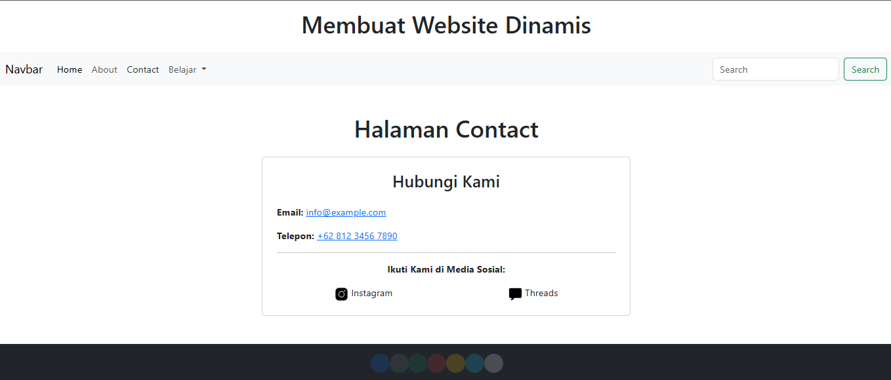
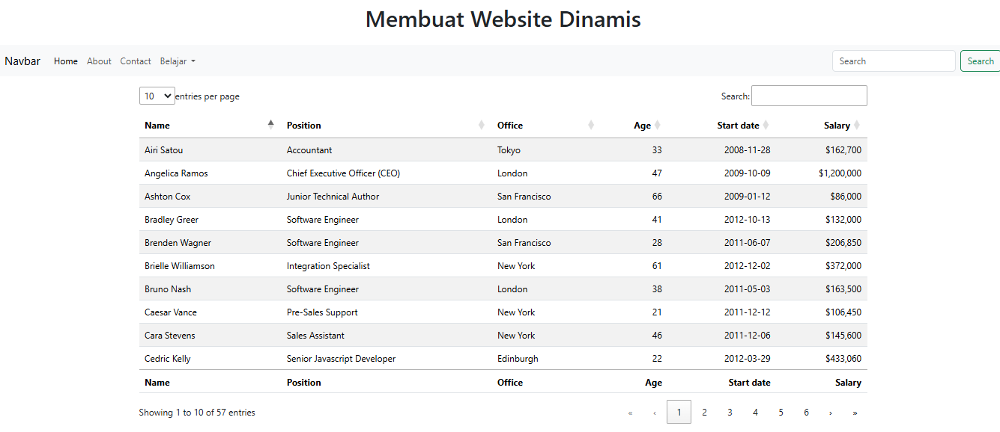
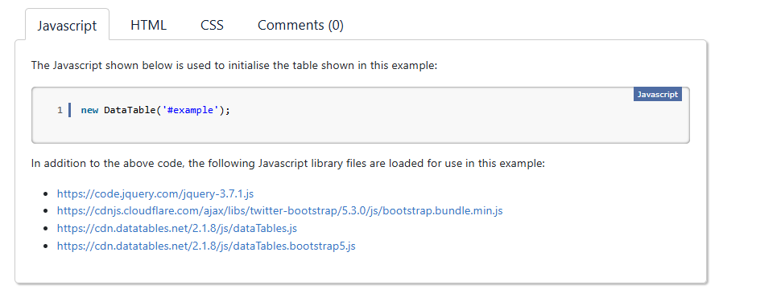

# UTS { Pertemuan ke 8} 

## Profil
|  |  |
| -------- | --- |
| **Nama** | Muhammad Faiz Iqbal |
| **Kelas** | TI.23.A.5 |
| **Mata Kuliah** | Pemrograman Web 1 |

# Membuat Website-Dinamis

## Langkah-Langkah

## 1. Membuat file website-dinamis


## 2. Menjalankan Apache Server

Menjalankan Apache dari menu **XAMPP Control.**


### Mengakses Apache Client menggunakan 'website-dinamis'.

Pastikan webserver Apache sudah dijalankan. Kemudian untuk mengakses direktory tersebut pada web server dengan mengakses URL : http://localhost/website-dinamis/?page=home/

## 3. Membuat index : membuat website-dinamis

### Membuat tampilan didalam

```
<!doctype html>
<html lang="en">

<head>
    <meta charset="utf-8">
    <meta name="viewport" content="width=device-width, initial-scale=1">
    <title>Bootstrap Demo</title>
    <!-- Bootstrap -->
    <link href="assets/css/bootstrap.min.css" rel="stylesheet">

    <!-- Datatables -->
    <link href="assets/datatables/dataTables.dataTables.css" rel="stylesheet">
</head>

<body>
    <header>
        <h1 class="text-center p-3">Membuat Website Dinamis</h1>
        <!-- Navbar -->
        <?php include "includes/navbar.php" ?>
        <!-- ./navbar -->
    </header>

    <!-- Konten -->
    <div class="container mt-3">
        <?php include "konten.php" ?>
    </div>
    <!-- ./konten -->

    <!-- Footer -->
    <footer class="bg-dark text-white text-center py-3 mt-5">
        <div class="container">
            <div class="row">
                <div class="col-12 d-flex justify-content-center">
                    <!-- Spinners -->
                    <div class="spinner-grow text-primary" role="status">
                        <span class="visually-hidden">Loading...</span>
                    </div>
                    <div class="spinner-grow text-secondary" role="status">
                        <span class="visually-hidden">Loading...</span>
                    </div>
                    <div class="spinner-grow text-success" role="status">
                        <span class="visually-hidden">Loading...</span>
                    </div>
                    <div class="spinner-grow text-danger" role="status">
                        <span class="visually-hidden">Loading...</span>
                    </div>
                    <div class="spinner-grow text-warning" role="status">
                        <span class="visually-hidden">Loading...</span>
                    </div>
                    <div class="spinner-grow text-info" role="status">
                        <span class="visually-hidden">Loading...</span>
                    </div>
                    <div class="spinner-grow text-light" role="status">
                        <span class="visually-hidden">Loading...</span>
                    </div>
                    <div class="spinner-grow text-dark" role="status">
                        <span class="visually-hidden">Loading...</span>
                    </div>
                    <!-- ./spinners -->
                </div>
            </div>
        </div>
    </footer>
    <!-- ./footer -->

    <!-- Scripts -->
    <script src="assets/jquery-3.7.1.js"></script>
    <script src="assets/datatables/dataTables.js"></script>
    <script src="assets/js/bootstrap.bundle.min.js"></script>

    <script>
    new DataTable('#example');
    </script>
</body>

</html>
```

### Menambahkan Data navbar

```
<nav class="navbar bg-dark navbar-expand-md bg-body-tertiary" data-bs- theme="dark">

    <div class="container-fluid">
        <a class="navbar-brand" href="?page=home">Navbar</a>
        <button class="navbar-toggler" type="button" data-bs-toggle="collapse" data-bs-target="#navbarSupportedContent"
            aria-controls="navbarSupportedContent" aria-expanded="false" aria- label="Toggle navigation">

            <span class="navbar-toggler-icon"></span>
        </button>
        <div class="collapse navbar-collapse" id="navbarSupportedContent">
            <ul class="navbar-nav me-auto mb-2 mb-lg-0">
                <li class="nav-item">
                    <a class="nav-link active" aria-current="page" href="?page=home">Home</a>
                </li>
                <li class="nav-item">
                    <a class="nav-link" href="?page=about">About</a>
                </li>
                <li class="nav-item">
                    <a class="nav-link" href="?page=contact">Contact</a>
                </li>

                <li class="nav-item dropdown">
                    <a class="nav-link dropdown-toggle" href="#" role="button" data-bs-toggle="dropdown"
                        aria-expanded="false">
                        Belajar
                    </a>
                    <ul class="dropdown-menu">
                        <li><a class="dropdown-item" href="?page=datatables">Datatables</a></li>

                        <li><a class="dropdown-item" href="?page=form">form</a></li>

                        <li>
                            <hr class="dropdown-divider">
                        </li>
                        <li><a class="dropdown-item" href="#">Something else here</a></li>

                    </ul>
                </li>
            </ul>
            <form class="d-flex" role="search">
                <input class="form-control me-2" type="search" placeholder="Search" aria-label="Search">

                <button class="btn btn-outline-success" type="submit">Search</button>

            </form>
        </div>
    </div>
</nav>
```

***Output Ketika Berhasil :***


## 3. Menambahkan Home

dengan memasukan card dari https://getbootstrap.com/docs/5.3/components/card/


```
<div class="container">
    <div class="row">
        <!-- Card 1 -->
        <div class="col-md-6">
            <div class="card" style="width: 100%;">
                
                <div class="card-body">
                    <h5 class="card-title">Cisco Networking Academy</h5>
                    <p class="card-text">program tanggung jawab sosial perusahaan (CSR) internasional 
                        yang bertujuan membantu siswa dan pendidik mengembangkan keterampilan untuk pekerjaan di bidang teknologi informasi.</p>
                    <a href="https://www.netacad.com/courses/networking-basics?courseLang=en-US" class="btn btn-primary">Go somewhere</a>
                </div>
            </div>
        </div>

        <!-- Card 2 -->
        <div class="col-md-6">
            <div class="card" style="width: 88%;">
                
                <div class="card-body">
                    <h5 class="card-title">Git Hub</h5>
                    <p class="card-text">platform berbasis web yang digunakan untuk mengelola dan menyimpan kode sumber perangkat lunak
                        GitHub menggunakan sistem kontrol versi Git dan layanan hosting internet.</p>
                    <a href="https://github.com/dashboard" class="btn btn-primary">Go somewhere</a>
                </div>
            </div>
        </div>
    </div>
</div>
```
## 4. Menambahkan About
dengan memasukan image dan carousel dari https://getbootstrap.com/docs/5.3/components/card/


## 5. Menambahkan Contant
dengan memasukan halaman contact 


```
<!DOCTYPE html>
<html lang="en">

<head>
    <meta charset="UTF-8">
    <meta name="viewport" content="width=device-width, initial-scale=1.0">
    <title>Contact</title>
    <link rel="stylesheet" href="https://cdnjs.cloudflare.com/ajax/libs/bootstrap/5.3.0/css/bootstrap.min.css">
</head>

<body>

    <div class="container mt-5">
        <h1 class="text-center">Halaman Contact</h1>
        <div class="row justify-content-center mt-4">
            <div class="col-md-6">
                <div class="card p-4">
                    <h3 class="text-center">Hubungi Kami</h3>
                    <div class="contact-info mt-3">
                        <p><strong>Email:</strong> <a href="mailto:info@example.com">info@example.com</a></p>
                        <p><strong>Telepon:</strong> <a href="tel:+6281234567890">+62 812 3456 7890</a></p>
                        <hr>
                        <p class="text-center"><strong>Ikuti Kami di Media Sosial:</strong></p>
                        <div class="d-flex justify-content-around">
                            <a href="https://instagram.com/faiz.ball" target="_blank"
                                class="text-decoration-none text-dark">
                                 Instagram
                            </a>
                            <a href="https://threads.net/Iqbal |" target="_blank"
                                class="text-decoration-none text-dark">
                                 Threads
                            </a>
                        </div>
                    </div>
                </div>
            </div>
        </div>
    </div>

    <script src="https://cdnjs.cloudflare.com/ajax/libs/bootstrap/5.3.0/js/bootstrap.bundle.min.js"></script>
</body>
</html>
```
## Membuat Datatables di belajar
membrikan skrip unuk datatables.php yang mengacu pada: https://datatables.net/examples/basic_init/zero_configuration.html




## Membuat form di belajar
dengan menambahkan form dari https://getbootstrap.com/docs/5.3/forms/overview/#overview


- [ini adalah penjelasan yang lebih lengkap](https://drive.google.com/file/d/15CXc0FVemHqMzBvTEPF-s8iPX5zmoW1H/view?usp=drivesdk)

## SELESAI  
